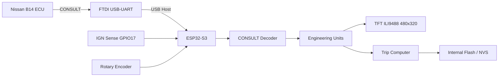

> **v3.9.10 CONFIG-GUARD FIX:** The protected ESP-IDF defaults are now stored in `config/b14_sdkconfig.defaults`. The clean script no longer uses the dangerous `sdkconfig.*` wildcard, so the source defaults cannot be deleted accidentally.

> **v3.9.10 SDKCONFIG-FIX:** `SDKCONFIG_DEFAULTS` is explicitly layered and stale `sdkconfig.*` is removed before build, C++ exceptions are enabled for Espressif VCP, and flash-size Kconfig is pinned to 16 MB.

# Nissan B14 CONSULT Dashboard Full v3.9.10

> **ENGINEERING UNITS FULL · INTERNAL FLASH · NO SD · NO RTC**  
> ESP32-S3 dashboard/logger สำหรับ Nissan Sentra B14 / GA16DNE ผ่าน Nissan CONSULT  
> Boot Splash: **`JOEVOHAN@261`**

---

## v3.9.10 POWER-ON DISPLAY FIX

รุ่นนี้เพิ่มลำดับ Power-on สำหรับ ILI9488 เพื่อแก้อาการ **จอขาวเมื่อ TFT และ ESP32 ได้ไฟพร้อมกัน**:

```text
POWER ON
  ↓
BL OFF (GPIO18)
CS HIGH (GPIO10)
RST LOW (GPIO8) 350 ms
  ↓
RST HIGH 180 ms
  ↓
SPI + ILI9488 init
  ↓
panel reset/init (retry สูงสุด 3 ครั้ง)
  ↓
clear BLACK while BL OFF
  ↓
draw JOEVOHAN@261 splash
  ↓
BL ON
  ↓
Dashboard
```

คำสั่ง Serial เพิ่ม: `DISPLAYSTATUS`

---

## สารบัญ

- [ภาพรวมโครงการ](#ภาพรวมโครงการ)
- [จุดเด่นของ v3.9.10](#จุดเด่นของ-v397)
- [สถาปัตยกรรมระบบ](#สถาปัตยกรรมระบบ)
- [ฮาร์ดแวร์และการต่อขา](#ฮาร์ดแวร์และการต่อขา)
- [หน้าจอ Dashboard](#หน้าจอ-dashboard)
- [Engineering Units](#engineering-units)
- [MAF EST g/s](#maf-est-gs)
- [TPS 0–100%](#tps-0100)
- [O2 Narrowband](#o2-narrowband)
- [Ignition Timing](#ignition-timing)
- [Fuel Correction](#fuel-correction)
- [ระบบ Trip / Internal Flash](#ระบบ-trip--internal-flash)
- [คำสั่ง Serial Monitor](#คำสั่ง-serial-monitor)
- [การติดตั้งแบบครบทุกขั้นตอน](#การติดตั้งแบบครบทุกขั้นตอน)
- [การทดสอบหลัง Upload](#การทดสอบหลัง-upload)
- [การใช้งาน Rotary Encoder](#การใช้งาน-rotary-encoder)
- [Troubleshooting](#troubleshooting)
- [โครงสร้างโปรเจกต์](#โครงสร้างโปรเจกต์)
- [ข้อควรระวัง](#ข้อควรระวัง)

---

## ภาพรวมโครงการ

โปรเจกต์นี้เป็น Dashboard + Trip Logger สำหรับ Nissan B14 โดยใช้ ESP32-S3 รับข้อมูลจาก ECU ผ่าน Nissan CONSULT และแสดงผลบนจอ TFT ILI9488 ขนาด 480×320 พิกเซล

รุ่น v3.9.10 ตัด microSD และ RTC ออกทั้งหมด แล้วเก็บข้อมูลสำคัญไว้ใน **Internal Flash / NVS** ของ ESP32-S3 เพื่อให้ระบบเรียบง่ายและลดจุดเสียจาก SD card, socket, filesystem และ RTC

ระบบยังคงเก็บข้อมูลดิบจาก CONSULT ไว้สำหรับตรวจสอบ พร้อมสร้างค่าที่อ่านง่ายทางวิศวกรรม เช่น `TPS %`, `MAF EST g/s`, `O2 RICH/LEAN/MID`, `BTDC/ATDC` และ `Fuel Correction %`

---

## จุดเด่นของ v3.9.10

- Boot Splash ตัวใหญ่เต็มจอ: **`JOEVOHAN@261`** ประมาณ 2.6 วินาที
- ESP32-S3 + ESP-IDF 5.4.1
- TFT ILI9488 SPI 480×320
- Nissan CONSULT ผ่าน FTDI USB Host
- FTDI เป้าหมาย VID:PID `0403:6001`
- CONSULT link `9600 baud, 8-N-1`
- 4 หน้า Dashboard
- Internal Flash / NVS เท่านั้น
- Trip History สูงสุด 100 รายการ
- Event History สูงสุด 128 รายการ
- Active-trip snapshot อัตโนมัติทุก 30 วินาที หรือทุก 0.5 km
- Power-loss recovery
- IGN sense GPIO17 พร้อม Auto Save
- Manual Date แบบ NO RTC
- MAF แสดง `MAF EST g/s` พร้อม RAW V
- TPS แสดง 0–100% พร้อม RAW V
- O2 narrowband แสดง `LEAN / MID / RICH`
- Ignition แสดง `BTDC / ATDC`
- A/F Alpha แสดงเป็น Fuel Correction delta
- Build แบบ `-j 1` เพื่อเพิ่มเสถียรภาพบน Windows
- ใช้ project-local `esp_lcd` SPI-only override เพื่อตัด RGB LCD source ที่ไม่ใช้

---

## สถาปัตยกรรมระบบ



ข้อมูลสดจะอยู่ใน RAM ก่อน แล้วจึง snapshot ลง NVS เป็นช่วง ๆ เพื่อลดจำนวนรอบการเขียน Flash

---

## ฮาร์ดแวร์และการต่อขา

### TFT ILI9488 SPI

| สัญญาณ | ESP32-S3 |
|---|---:|
| TFT MOSI | GPIO11 |
| TFT MISO | GPIO13 |
| TFT SCLK | GPIO12 |
| TFT CS | GPIO10 |
| TFT DC | GPIO9 |
| TFT RST | GPIO8 |
| TFT BL | GPIO18 |

ค่าที่ใช้ใน Firmware:

```text
Resolution : 480 × 320
SPI Host   : SPI2_HOST
SPI Clock  : 10 MHz
```

### Rotary Encoder

| สัญญาณ | ESP32-S3 |
|---|---:|
| CLK | GPIO5 |
| DT | GPIO6 |
| SW | GPIO7 |

> Rotary ใช้ pull-up ภายใน และไฟ `+` ของ Encoder ต้องเป็น **3.3 V**

### IGN Sense

```text
IGN Sense = GPIO17
Active    = HIGH
Debounce  = 300 ms
```

> **ห้ามต่อไฟ 12 V จากรถเข้าขา GPIO17 โดยตรง** ต้องผ่าน automotive-safe divider, optocoupler หรือ input conditioner ก่อนเสมอ

### microSD / RTC

```text
microSD : NOT USED
RTC     : NOT USED
```

ไม่มีการ initialize SDMMC/SDSPI และไม่มี RTC driver ในระบบนี้

---

## หน้าจอ Dashboard

ระบบมี 4 หน้า:

### 1. DRIVE DASH

แสดงค่าหลักระหว่างขับ เช่น RPM, Speed, Fuel Economy, Trip และสถานะ ECU/USB/IGN

### 2. ENGINE DATA

แสดงข้อมูลทางวิศวกรรม + RAW trace เช่น:

```text
RPM       838 rpm
SPD         0 km/h
INJ      3.24 ms
DUTY     2.26 %
TPS       0.0 %   RAW 0.56 V
MAF EST   3.7 g/s RAW 1.71 V
O2       0.82 V   RICH
IGN        10 BTDC
AAC      30.0 %
FUEL CORR -3.0 %
FUEL     0.98 L/h
ECT        87 C
BAT      13.9 V
```

### 3. TRIP LOGGER

แสดง Trip ปัจจุบัน หรือ Last Saved Trip เช่น ระยะทาง น้ำมันโดยประมาณ ค่าใช้จ่าย เวลาเครื่องยนต์ เวลาเดินเบา และค่าเฉลี่ย km/L

### 4. SETTINGS

ใช้ Rotary สำหรับ:

- Fuel Price
- Fuel Calibration
- เปิด/ปิดการแสดง O2
- เปิด/ปิดการแสดง AAC
- เปิด/ปิดการแสดง A/F / Fuel Correction
- NEXT DAY
- BACK

---

## Engineering Units

| Parameter | ECU/RAW | Dashboard v3.9.10 | หมายเหตุ |
|---|---|---|---|
| RPM | decoded | rpm | หน่วยมาตรฐานเดิม |
| Speed | decoded | km/h | หน่วยมาตรฐานเดิม |
| Injector Pulse | decoded | ms | หน่วยมาตรฐานเดิม |
| Injector Duty | derived | % | หน่วยมาตรฐานเดิม |
| MAF | V | **MAF EST g/s + RAW V** | ค่า g/s เป็น estimate |
| TPS | V | **0–100% + RAW V** | ใช้ calibration เริ่มต้น |
| O2 | V | **V + LEAN/MID/RICH** | Narrowband ไม่แปลงเป็น AFR ปลอม |
| Coolant | decoded | C | อุณหภูมิ |
| Battery | decoded | V | แรงดันระบบ |
| Ignition | decoded deg | **BTDC / ATDC** | ค่า positive = BTDC |
| AAC | decoded | % | คงเดิม |
| A/F Alpha | % | **Fuel Correction delta %** | `Alpha - 100%` |
| Fuel Rate | estimated | L/h | ค่าประมาณ |
| Economy | estimated | km/L | ค่าประมาณ |

---

## MAF EST g/s

Nissan CONSULT channel ของ MAF ในระบบนี้ถูกเก็บเป็นแรงดันดิบ `V` ดังนั้น v3.9.10 **ไม่อ้างว่า g/s เป็นค่าตรงจาก ECU**

โมเดลประมาณ:

```text
MAF_EST = Displacement × (RPM / 120) × VE × Air Density
```

ค่าคงที่เริ่มต้น:

```text
Engine displacement = 1.60 L
Air density         = 1.18 g/L
```

VE Model ที่ใช้:

| เงื่อนไข | VE |
|---|---:|
| Closed throttle หรือ TPS < 3%, RPM < 1200 | 0.28 |
| Closed throttle หรือ TPS < 3%, RPM 1200–2999 | 0.20 |
| Closed throttle หรือ TPS < 3%, RPM ≥ 3000 | 0.18 |
| TPS < 10% | 0.30 |
| TPS < 20% | 0.35 |
| TPS < 40% | 0.50 |
| TPS < 70% | 0.65 |
| TPS ≥ 70% | 0.80 |
| RPM > 4500 และ TPS > 40% | เพิ่ม VE อีก 0.05 |

VE ถูก clamp อยู่ในช่วง `0.15–0.90`

MAF EST จะ valid เมื่อ:

```text
RPM >= 300
MAF RAW อยู่ระหว่าง 0.20–4.80 V
ผลคำนวณอยู่ในช่วง 0–250 g/s
```

ตัวอย่าง Serial:

```text
MAF_EST=3.69 g/s (RAW=1.710 V)
```

> เพื่อความถูกต้องในการวิเคราะห์รถจริง ควรเก็บ RAW V ไว้ตลอดและปรับ VE/calibration จากข้อมูลจริงในภายหลัง

---

## TPS 0–100%

ค่าเริ่มต้นสำหรับ calibration:

```text
Closed throttle = 0.56 V → 0%
WOT             = 4.00 V → 100%
```

สูตร:

```text
TPS% = (TPS_V - 0.56) / (4.00 - 0.56) × 100
```

ค่าถูก clamp ที่ `0–100%`

ถ้า ECU closed-throttle switch ทำงาน และค่าที่คำนวณต่ำกว่า 8% Firmware จะ force เป็น 0% เพื่อไม่ให้ plate ปิดแต่หน้าจอแสดง 1–3%

---

## O2 Narrowband

ระบบเก็บแรงดันดิบและแสดงสถานะ:

```text
<= 0.35 V  = LEAN
0.35–0.55  = MID / switching zone
>= 0.55 V  = RICH
```

ตัวอย่าง:

```text
O2 = 0.82 V RICH
O2 = 0.12 V LEAN
```

> O2 narrowband **ไม่ถูกแปลงเป็น AFR แบบ wideband** เพราะจะทำให้ผู้ใช้เข้าใจว่าค่านั้นแม่นกว่าความสามารถจริงของ sensor

---

## Ignition Timing

```text
ค่าบวก = BTDC
ค่าลบ = ATDC
```

ตัวอย่าง:

```text
10  -> 10 BTDC
-3  -> 3 ATDC
```

---

## Fuel Correction

A/F Alpha ดิบยังถูกเก็บไว้ แต่ Dashboard แสดงเป็น:

```text
Fuel Correction = Alpha - 100%
```

ตัวอย่าง:

```text
Alpha  97% -> Fuel Correction -3%
Alpha 100% -> Fuel Correction  0%
Alpha 105% -> Fuel Correction +5%
```

---

## ระบบ Trip / Internal Flash

### Storage

Firmware ตั้ง Flash เป็น 16 MB และใช้ custom partition:

```text
nvs       0x009000  0x006000
phy_init  0x00F000  0x001000
factory   0x010000  0x400000
tripnvs   0x410000  0x060000
```

`tripnvs` มีขนาด 384 KiB สำหรับข้อมูล NVS ของระบบ Trip/History/Event

### Ring Buffer

```text
Trip History  = 100 records
Event History = 128 records
```

แต่ละ record ถูกเก็บเป็น NVS key แยก ไม่ rewrite history blob ทั้งก้อนเมื่อมีรายการใหม่

### Snapshot / Recovery

Active trip จะ snapshot เมื่อ:

```text
ทุก 30 วินาที
หรือ
ระยะทางเพิ่มทุก 0.5 km
หรือ
มีคำสั่ง SAVE
หรือ
IGN OFF
```

หากไฟหายระหว่าง Trip ระบบสามารถใช้ active snapshot เพื่อกู้ข้อมูลเมื่อเปิดครั้งถัดไป

### IGN Auto Save

เมื่อ GPIO17 ตรวจพบ IGN OFF:

```text
IGN OFF
  ↓
Final Snapshot
  ↓
Finalize Trip
  ↓
Save Internal Flash
  ↓
Update History / Totals
```

ถ้าไม่ได้ต่อ IGN Sense ระบบยังสามารถทำงานด้วย RPM-based trip stop + power-loss recovery ได้

---

## คำสั่ง Serial Monitor

เปิดด้วย:

```powershell
pio device monitor -p COM4 -b 115200
```

คำสั่งที่รองรับ:

| Command | หน้าที่ |
|---|---|
| `HELP` | แสดงรายการคำสั่ง |
| `STATUS` | แสดงสถานะระบบและ Firmware |
| `UNITS` | แสดงโมเดล Engineering Units |
| `DATE YYYY-MM-DD` | ตั้งวันที่แบบ Manual / NO RTC |
| `NEXTDAY` | เพิ่มวันที่ 1 วันและ reset Daily |
| `PRICE 36.70` | ตั้งราคาน้ำมันสำหรับ Trip ถัดไป |
| `CAL 1.000` | ตั้ง Fuel Calibration สำหรับ Trip ถัดไป |
| `TOTALS` | แสดง Daily + Lifetime totals |
| `LAST` | แสดง Trip ล่าสุด |
| `HISTORY` | แสดง 10 Trip ล่าสุด |
| `EVENTS` | แสดง 10 Event ล่าสุด |
| `FLASHSTATUS` | แสดง Internal Flash/NVS/Ring status |
| `NVSSTATUS` | แสดง Storage health report |
| `SAVE` | Force active-trip snapshot |
| `IGNOFF` | จำลอง IGN OFF สำหรับ bench test |
| `RESETDAILY CONFIRM` | ล้าง Daily totals |
| `CLEARHISTORY CONFIRM` | ล้าง Trip History |
| `CLEAREVENTS CONFIRM` | ล้าง Event History |

---

## การติดตั้งแบบครบทุกขั้นตอน

### 1. ดาวน์โหลด ZIP

ชื่อไฟล์:

```text
Nissan-B14-CONSULT-Dashboard-Full-v3.9.10-POWER-ON-DISPLAY-FIX-FULL-INTERNAL-FLASH-NO-SD-NO-RTC.zip
```

### 2. หยุด Serial Monitor เดิม

```text
Ctrl+C
```

### 3. ตรวจ ZIP ใน Downloads

```powershell
Get-ChildItem "$env:USERPROFILE\Downloads" -Filter "Nissan-B14-CONSULT-Dashboard-Full-v3.9.10*.zip"
```

### 4. ลบโฟลเดอร์ v3.9.10 เดิมถ้ามี

```powershell
Remove-Item "C:\Nissan-B14-CONSULT-Dashboard-Full-v3.9.10-POWER-ON-DISPLAY-FIX-FULL-INTERNAL-FLASH-NO-SD-NO-RTC" -Recurse -Force -ErrorAction SilentlyContinue
```

### 5. หา ZIP ล่าสุด

```powershell
$zip = Get-ChildItem "$env:USERPROFILE\Downloads" -Filter "Nissan-B14-CONSULT-Dashboard-Full-v3.9.10*.zip" |
Sort-Object LastWriteTime -Descending |
Select-Object -First 1

$zip.FullName
```

### 6. แตกไฟล์ลง C:\

```powershell
Expand-Archive $zip.FullName -DestinationPath "C:\" -Force
```

### 7. เข้าโฟลเดอร์โปรเจกต์

```powershell
cd "C:\Nissan-B14-CONSULT-Dashboard-Full-v3.9.10-POWER-ON-DISPLAY-FIX-FULL-INTERNAL-FLASH-NO-SD-NO-RTC"
```

### 8. ตรวจไฟล์

```powershell
dir
dir .\components\esp_lcd
Get-Content .\src\idf_component.yml
```

ควรพบไฟล์หลัก:

```text
platformio.ini
CMakeLists.txt
partitions.csv
sdkconfig.defaults
src\
components\esp_lcd\
tools\
```

### 9. ตรวจพื้นที่ว่าง

```powershell
Get-PSDrive C
```

แนะนำให้เหลืออย่างน้อย **5 GB** ก่อน build

### 10. Full Clean

```powershell
Remove-Item .pio -Recurse -Force -ErrorAction SilentlyContinue
Remove-Item managed_components -Recurse -Force -ErrorAction SilentlyContinue
Remove-Item dependencies.lock -Force -ErrorAction SilentlyContinue
Remove-Item sdkconfig -Force -ErrorAction SilentlyContinue
```

### 11. Compile แบบ Single Job

```powershell
pio run -j 1
```

หรือใช้:

```powershell
powershell -ExecutionPolicy Bypass -File .\BUILD_CLEAN.ps1
```

ต้องรอจนเห็น:

```text
[SUCCESS]
```

> ถ้า `[FAILED]` ห้าม Upload ให้แก้ Build error ก่อน

### 12. ตรวจ COM Port

```powershell
pio device list
```

ตัวอย่าง:

```text
COM4
```

### 13. Upload

```powershell
pio run -t upload
```

ผลที่ต้องการ:

```text
Hash of data verified.
Leaving...
Hard resetting via RTS pin...
[SUCCESS]
```

### 14. เปิด Serial Monitor

```powershell
pio device monitor -p COM4 -b 115200
```

ถ้า ESP32 อยู่ COM อื่น ให้เปลี่ยนเลข COM

### 15. กด EN/RESET 1 ครั้ง

หน้า TFT ต้องเริ่มด้วย:

```text
JOEVOHAN@261
```

แล้วเข้าสู่ Dashboard

---

## การทดสอบหลัง Upload

### ตรวจ Firmware

```text
STATUS
```

ควรพบ:

```text
FW=3.9.7-POWER-ON-DISPLAY-FIX-FULL
```

### ตรวจ Engineering Units

```text
UNITS
```

ควรแสดง:

```text
MAF EST  : g/s estimate + RAW V
TPS      : 0-100% EST + RAW V
O2       : V + LEAN/MID/RICH
IGN      : BTDC/ATDC
FUEL CORR: Alpha - 100%
```

### ตรวจ Internal Flash

```text
FLASHSTATUS
```

และ:

```text
NVSSTATUS
```

### ตั้งวันที่

```text
DATE 2026-08-10
```

> ควรตั้งตอนเครื่อง/Trip ไม่ active

### ตรวจ Logs

```text
HISTORY
EVENTS
TOTALS
LAST
```

### Bench-test IGN save

เมื่อมี Active Trip:

```text
SAVE
IGNOFF
```

จากนั้นตรวจ:

```text
LAST
HISTORY
FLASHSTATUS
```

### ต่อรถจริงหลัง TFT + NVS ผ่านแล้ว

เมื่อเชื่อม FTDI/CONSULT กับรถ ให้ตรวจ Serial ว่า FTDI เปิดได้และ ECU เริ่มส่ง sensor frames

ตัวอย่าง live output:

```text
RPM=838 rpm |
SPD=0 km/h |
INJ=3.24 ms |
DUTY=2.26% |
MAF_EST=3.69 g/s (RAW=1.710 V) |
ECT=87 C |
O2=0.82 V RICH |
BAT=13.92 V |
TPS=0.0% (RAW=0.56 V) |
IGN=10 BTDC |
AAC=30.0% |
FUEL_CORR=-3.0% (ALPHA=97%) |
FUEL_EST=0.98 L/h
```

---

## การใช้งาน Rotary Encoder

### หน้าปกติ

```text
หมุน CW     → หน้าถัดไป
หมุน CCW    → หน้าก่อนหน้า
กดสั้น      → เข้า SETTINGS
กดค้าง ≥1s → กลับ DRIVE DASH
```

### หน้า SETTINGS

เมื่อยังไม่ได้ Edit:

```text
หมุน         → เลื่อนรายการ
กดสั้น       → เลือก / Toggle / Edit
กดค้าง       → กลับ DRIVE DASH
```

ขณะ Edit Fuel Price / Calibration:

```text
หมุน         → เพิ่ม/ลดค่า
กดสั้น       → Save
กดค้าง       → Cancel
```

---

## Troubleshooting

### 1. `CMake 3.20 or higher is required`

โปรเจกต์นี้ pin ILI9488 component ไว้ที่:

```text
atanisoft/esp_lcd_ili9488 = 1.0.9
```

เพื่อให้เข้ากับ PlatformIO / ESP-IDF 5.4.1 ในชุดนี้

### 2. USB HAL Error

Error รุ่นก่อน เช่น:

```text
usb_dwc_hal_fifo_config_is_valid
usb_dwc_hal_set_fifo_config
```

v3.9.10 ใช้ component ชุด:

```text
usb_host_cdc_acm  = 2.0.0
usb_host_ftdi_vcp = 2.0.0
usb_host_vcp      = 1.0.0~5
```

และไม่ใช้ managed `espressif/usb` รุ่นที่เคยชนกับ HAL

### 3. `usb/vcp_ftdi.h: No such file or directory`

ระบบใช้ C++ bridge:

```text
src/ftdi_bridge.h
src/ftdi_bridge.cpp
```

เพื่อเชื่อม `main.c` กับ VCP/FTDI C++ API

### 4. GCC Internal Compiler Error ที่ `esp_lcd_panel_rgb.c`

โปรเจกต์มี local override:

```text
components/esp_lcd/
```

เพื่อ compile เฉพาะ SPI LCD path และไม่ compile RGB LCD source ที่ระบบนี้ไม่ใช้

แนะนำ build:

```powershell
pio run -j 1
```

### 5. `No space left on device`

ตรวจ:

```powershell
Get-PSDrive C
```

และใช้:

```powershell
pio system prune --dry-run
pio system prune -f
```

ก่อน build ใหม่

### 6. FTDI ไม่พบ

ถ้าเห็น:

```text
FTDI open failed: ESP_ERR_NOT_FOUND
```

ให้ตรวจ USB Host, สาย OTG, FTDI, ไฟเลี้ยง และ VID:PID ของอุปกรณ์ก่อน โดยระบบเป้าหมายคือ FTDI `0403:6001`

### 7. TFT ใช้งานไม่ได้

หาก TFT init ไม่ผ่าน Serial Monitor ยังสามารถใช้งานต่อได้ Firmware จะ log ว่า TFT disabled และระบบ Serial/Storage ยังทำงานได้

---

## โครงสร้างโปรเจกต์

```text
Nissan-B14-CONSULT-Dashboard-Full-v3.9.10-POWER-ON-DISPLAY-FIX-FULL-INTERNAL-FLASH-NO-SD-NO-RTC/
├── README.md
├── README_TH.md
├── platformio.ini
├── CMakeLists.txt
├── partitions.csv
├── sdkconfig.defaults
├── BUILD_CLEAN.ps1
├── ENGINEERING_UNITS_v3.9.10_TH.txt
├── INSTALL_FULL_v3.9.10_TH.txt
├── LCD_COMPILER_FIX_v3.9.5.txt
├── USB_CPP_BRIDGE_FIX_v3.9.5.txt
├── components/
│   └── esp_lcd/
│       ├── CMakeLists.txt
│       └── Kconfig
├── src/
│   ├── main.c
│   ├── dashboard.c
│   ├── dashboard.h
│   ├── rotary_encoder.c
│   ├── rotary_encoder.h
│   ├── ftdi_bridge.cpp
│   ├── ftdi_bridge.h
│   ├── CMakeLists.txt
│   └── idf_component.yml
└── tools/
    ├── parser_selftest.py
    ├── v37_feature_selftest.py
    ├── v39_feature_selftest.py
    └── v397_power_on_display_selftest.py
```

---

## Dependency Versions

```text
PlatformIO platform : espressif32@6.11.0
Framework            : ESP-IDF 5.4.1
ILI9488              : atanisoft/esp_lcd_ili9488 1.0.9
USB CDC ACM          : espressif/usb_host_cdc_acm 2.0.0
FTDI VCP             : espressif/usb_host_ftdi_vcp 2.0.0
USB Host VCP         : espressif/usb_host_vcp 1.0.0~5
```

PlatformIO environment:

```text
nissan_b14_dashboard_full_v397_power_on_display
```

---

## ข้อควรระวัง

1. **MAF EST g/s เป็นค่าประมาณ** ไม่ใช่ MAF g/s ที่ ECU ส่งโดยตรง
2. **TPS % เป็น engineering estimate** จาก calibration เริ่มต้น 0.56 V / 4.00 V
3. ค่า Fuel Rate / Fuel Used / Economy เป็นค่าคำนวณและต้อง calibration กับรถจริงหากต้องการความแม่นสูง
4. O2 ที่ใช้เป็น narrowband จึงแสดง Lean/Mid/Rich ไม่ใช่ AFR แบบ wideband
5. ห้ามต่อ 12 V จากระบบรถยนต์เข้าขา ESP32 GPIO โดยตรง
6. ก่อนแก้ wiring ให้ปิดไฟระบบก่อนทุกครั้ง
7. การใช้งานขณะขับรถควรให้ผู้ขับโฟกัสถนน ไม่ควรปรับเมนูหรือ Serial Monitor ระหว่างขับ

---

## สถานะเวอร์ชัน

```text
Firmware     : 3.9.7-POWER-ON-DISPLAY-FIX-FULL
Display      : ILI9488 SPI 480×320
Storage      : Internal Flash / NVS
Trip History : 100
Event History: 128
SD Card      : NOT USED
RTC          : NOT USED
Boot Brand   : JOEVOHAN@261
```

---

## Quick Start

```powershell
cd "C:\Nissan-B14-CONSULT-Dashboard-Full-v3.9.10-POWER-ON-DISPLAY-FIX-FULL-INTERNAL-FLASH-NO-SD-NO-RTC"

Remove-Item .pio -Recurse -Force -ErrorAction SilentlyContinue
Remove-Item managed_components -Recurse -Force -ErrorAction SilentlyContinue
Remove-Item dependencies.lock -Force -ErrorAction SilentlyContinue
Remove-Item sdkconfig -Force -ErrorAction SilentlyContinue

pio run -j 1
pio device list
pio run -t upload
pio device monitor -p COM4 -b 115200
```

หลังเปิด Monitor ให้กด `EN/RESET` 1 ครั้ง แล้วตรวจตามลำดับ:

```text
STATUS
UNITS
FLASHSTATUS
NVSSTATUS
DATE 2026-08-10
TOTALS
HISTORY
EVENTS
HELP
```

---

**Nissan B14 CONSULT Dashboard Full v3.9.10**  
**JOEVOHAN@261**
