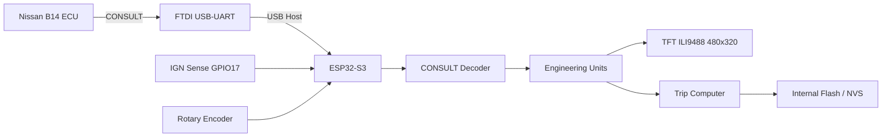

[README_v3.9.10.md](https://github.com/user-attachments/files/30936127/README_v3.9.10.md)
# Nissan B14 CONSULT Dashboard Full v3.9.10

> **CONFIG-GUARD FIX · POWER-ON DISPLAY FIX · ENGINEERING UNITS · INTERNAL FLASH/NVS · NO SD · NO RTC**  
> ESP32-S3 dashboard/logger สำหรับ Nissan Sentra B14 / GA16DNE ผ่าน Nissan CONSULT  
> Boot Splash: **`JOEVOHAN@261`**

---

## ภาพรวม

โปรเจกต์นี้ใช้ ESP32-S3 รับข้อมูลจาก ECU Nissan B14 ผ่าน Nissan CONSULT โดยใช้ FTDI USB-UART ในโหมด USB Host แล้วแสดงข้อมูลบน TFT ILI9488 SPI 480×320 พร้อม Trip Logger, Event Logger และการเก็บข้อมูลใน Internal Flash/NVS

รุ่น **v3.9.10** เน้นแก้ปัญหาการ Build และ Boot ที่พบจากการใช้งานจริง:

- ป้องกัน `sdkconfig.defaults` ถูกลบตอน Clean
- เปิด C++ Exceptions สำหรับ Espressif USB Host VCP/FTDI bridge
- ใช้ชื่อ Project/Environment/Workspace แบบสั้น ลดปัญหา Windows path ยาว
- ใช้ `esp_lcd` แบบ SPI-only เพื่อตัด RGB LCD source ที่ไม่ใช้
- เพิ่ม Power-on sequence สำหรับ ILI9488 เพื่อลดอาการ **จอขาวเมื่อ TFT และ ESP32 ได้ไฟพร้อมกัน**
- แสดงค่าทางวิศวกรรม เช่น `MAF EST g/s`, `TPS %`, `O2 LEAN/MID/RICH`, `BTDC/ATDC`, `Fuel Correction %`
- ไม่ใช้ microSD
- ไม่ใช้ RTC
- เก็บ Trip / History / Events ใน Internal Flash/NVS

---

## สถานะเวอร์ชัน

```text
Firmware : 3.9.10-CONFIG-GUARD-FIX-FULL
PIO env  : b14v310
Project  : b14v310
Workspace: C:\pio\b14v310
Target   : ESP32-S3 DevKitC-1
Flash cfg: 8 MB
Framework: ESP-IDF 5.4.1
Platform : espressif32@6.11.0
```

> `platformio.ini` ของรุ่นนี้ build แบบ 8 MB เพื่อให้ตรงกับ board definition `ESP32-S3-DevKitC-1-N8` ที่ PlatformIO รายงานในระบบทดสอบ และ partition table ของโปรเจกต์อยู่ภายในขนาดนี้

---

## System Architecture



---

## Hardware Pin Mapping

### TFT ILI9488 SPI

| Signal | ESP32-S3 |
|---|---:|
| TFT MOSI | GPIO11 |
| TFT MISO | GPIO13 |
| TFT SCLK | GPIO12 |
| TFT CS | GPIO10 |
| TFT DC | GPIO9 |
| TFT RST | GPIO8 |
| TFT BL | GPIO18 |

ค่าหลัก:

```text
Resolution : 480 × 320
SPI Host   : SPI2_HOST
SPI Clock  : 10 MHz
```

### Rotary Encoder

| Signal | ESP32-S3 |
|---|---:|
| CLK | GPIO5 |
| DT | GPIO6 |
| SW | GPIO7 |

ใช้ไฟ **3.3 V** และ pull-up ภายใน

### IGN Sense

```text
GPIO17
Active HIGH
Debounce 300 ms
```

> **ห้ามต่อไฟ 12 V จากรถเข้าขา ESP32 โดยตรง** ต้องผ่านวงจรแบ่งแรงดัน, optocoupler หรือ automotive input conditioner

### SD / RTC

```text
microSD : NOT USED
RTC     : NOT USED
```

---

## Power-on Display Fix

อาการที่แก้:

```text
เปิดไฟ TFT + ESP32 พร้อมกัน
        ↓
บางครั้ง ILI9488 init ไม่สำเร็จ
        ↓
Backlight ติด แต่ภาพไม่ถูก initialize
        ↓
จอขาว
```

v3.9.10 ใช้แนวทาง:

```text
POWER ON
  ↓
Backlight OFF
CS HIGH
RST LOW
  ↓
Power settle delay
  ↓
RST HIGH
  ↓
SPI + ILI9488 init
  ↓
Panel reset / init
  ↓
Clear screen
  ↓
Draw splash
  ↓
Backlight ON
  ↓
JOEVOHAN@261
  ↓
Dashboard
```

คำสั่งตรวจสถานะ:

```text
DISPLAYSTATUS
```

---

## Dashboard 4 หน้า

### 1. DRIVE DASH

แสดงข้อมูลหลักระหว่างขับ เช่น:

- RPM
- Speed
- Instant fuel economy
- Trip
- ECU/USB status
- IGN status

### 2. ENGINE DATA

ตัวอย่าง:

```text
RPM        838 rpm
SPD          0 km/h
INJ       3.24 ms
DUTY      2.26 %
TPS        0.0 %   RAW 0.56 V
MAF EST    3.7 g/s RAW 1.71 V
O2        0.82 V   RICH
IGN         10 BTDC
AAC       30.0 %
FUEL CORR -3.0 %
FUEL      0.98 L/h
ECT         87 C
BAT       13.9 V
```

### 3. TRIP LOGGER

แสดงข้อมูล Trip เช่น:

- Distance
- Estimated fuel used
- Estimated fuel cost
- Engine time
- Moving time
- Idle time
- Average km/L

### 4. SETTINGS / SYSTEM

ใช้สำหรับตั้งค่าหรือดูสถานะระบบ เช่น:

- Fuel price
- Fuel calibration
- Display options
- Date / Daily reset
- Flash/NVS status

---

## Engineering Units

| Parameter | Raw/ECU | Dashboard |
|---|---|---|
| RPM | decoded | rpm |
| Speed | decoded | km/h |
| Injector Pulse | decoded | ms |
| Injector Duty | derived | % |
| MAF | Voltage | **MAF EST g/s + RAW V** |
| TPS | Voltage | **0–100% + RAW V** |
| O2 | Voltage | **V + LEAN/MID/RICH** |
| Coolant | decoded | °C / C |
| Battery | decoded | V |
| Ignition | degrees | **BTDC / ATDC** |
| AAC | decoded | % |
| A/F Alpha | % | **Fuel Correction delta %** |
| Fuel Rate | estimated | L/h |
| Economy | estimated | km/L |

---

## MAF EST g/s

บน ECU/CONSULT ชุดนี้ Firmware เก็บค่า MAF ดิบเป็นแรงดัน ดังนั้น `MAF EST` คือ **ค่าประมาณ** ไม่ใช่ค่า g/s ที่ ECU ส่งมาโดยตรง

โมเดล:

```text
MAF_EST = Displacement × (RPM / 120) × VE × Air Density
```

ค่าพื้นฐาน:

```text
Engine displacement = 1.60 L
Air density          = 1.18 g/L
```

VE model เริ่มต้น:

| เงื่อนไข | VE |
|---|---:|
| TPS < 3%, RPM < 1200 | 0.28 |
| TPS < 3%, RPM 1200–2999 | 0.20 |
| TPS < 3%, RPM ≥ 3000 | 0.18 |
| TPS < 10% | 0.30 |
| TPS < 20% | 0.35 |
| TPS < 40% | 0.50 |
| TPS < 70% | 0.65 |
| TPS ≥ 70% | 0.80 |

RAW voltage ยังคงแสดงและเก็บไว้เพื่อใช้ calibration ในอนาคต

ตัวอย่าง:

```text
MAF_EST=3.69 g/s (RAW=1.710 V)
```

---

## TPS 0–100%

ค่า calibration เริ่มต้น:

```text
Closed throttle = 0.56 V
WOT             = 4.00 V
```

สูตร:

```text
TPS% = (TPS_V - 0.56) / (4.00 - 0.56) × 100
```

ผลลัพธ์ถูกจำกัดไว้ในช่วง 0–100%

---

## O2 Narrowband

สถานะ:

```text
<= 0.35 V = LEAN
0.35–0.55 = MID / switching
>= 0.55 V = RICH
```

Firmware **ไม่แปลง Narrowband O2 เป็น AFR แบบ Wideband** เพื่อหลีกเลี่ยงค่าที่ดูแม่นแต่ไม่ตรงความสามารถของ sensor

---

## Ignition Timing

```text
ค่าบวก = BTDC
ค่าลบ = ATDC
```

ตัวอย่าง:

```text
 10 → 10 BTDC
 -3 →  3 ATDC
```

---

## Fuel Correction

ใช้:

```text
Fuel Correction = A/F Alpha - 100%
```

ตัวอย่าง:

```text
Alpha  97% → -3%
Alpha 100% →  0%
Alpha 105% → +5%
```

---

## Internal Flash / NVS

Firmware ใช้ NVS สำหรับ:

- Settings
- Manual date
- Active trip snapshot
- Trip history
- Event history
- Daily totals
- Lifetime totals
- UI settings

ความจุเชิงตรรกะ:

```text
Trip History  : 100 records
Event History : 128 records
```

Active Trip จะ snapshot เมื่อ:

```text
ทุก 30 วินาที
หรือ
ระยะทางเพิ่มประมาณ 0.5 km
หรือ
SAVE
หรือ
IGN OFF
```

รองรับ power-loss recovery จาก snapshot ล่าสุด

---

## Protected SDK Configuration

จุดสำคัญของ v3.9.10 คือ config ต้นฉบับถูกย้ายไป:

```text
config/b14_sdkconfig.defaults
```

ค่าหลัก:

```text
CONFIG_COMPILER_CXX_EXCEPTIONS=y
CONFIG_ESPTOOLPY_FLASHSIZE_8MB=y
CONFIG_LOG_DEFAULT_LEVEL_INFO=y
```

CMake โหลดโดยตรง:

```cmake
set(SDKCONFIG_DEFAULTS "${CMAKE_SOURCE_DIR}/config/b14_sdkconfig.defaults")
```

จึงไม่ควรใช้คำสั่ง:

```powershell
Remove-Item sdkconfig.*
```

เพราะ wildcard ลักษณะนี้เคยทำให้ config ต้นฉบับถูกลบในรุ่นก่อน

v3.9.10 ใช้ `BUILD_CLEAN.ps1` ที่ลบเฉพาะ generated sdkconfig ตามชื่อที่กำหนดเท่านั้น

---

## USB / FTDI Dependencies

`src/idf_component.yml`

```yaml
dependencies:
  idf:
    version: ">=5.4.0,<5.5.0"
  espressif/usb_host_cdc_acm: "2.0.0"
  espressif/usb_host_ftdi_vcp: "2.0.0"
  espressif/usb_host_vcp: "1.0.0~5"
  atanisoft/esp_lcd_ili9488: "1.0.9"
```

C++ exceptions ถูกเปิดทั้งใน ESP-IDF config และ project build flags เพราะ FTDI/VCP bridge ใช้ C++ exception handling

---

## Serial Commands

เปิด Serial Monitor:

```powershell
pio device monitor -p COM4 -b 115200
```

คำสั่งหลัก:

| Command | Function |
|---|---|
| `HELP` | แสดงคำสั่ง |
| `STATUS` | Firmware/System status |
| `DISPLAYSTATUS` | TFT / power-on status |
| `UNITS` | Engineering-unit model |
| `DATE YYYY-MM-DD` | ตั้งวันที่แบบ Manual |
| `NEXTDAY` | เพิ่มวันที่ 1 วัน |
| `PRICE 36.70` | ตั้งราคาน้ำมัน |
| `CAL 1.000` | ตั้ง Fuel calibration |
| `TOTALS` | Daily/Lifetime totals |
| `LAST` | Trip ล่าสุด |
| `HISTORY` | Trip history |
| `EVENTS` | Event history |
| `FLASHSTATUS` | Internal Flash status |
| `NVSSTATUS` | NVS health/status |
| `SAVE` | Force active-trip snapshot |
| `IGNOFF` | จำลอง IGN OFF สำหรับ bench test |
| `RESETDAILY CONFIRM` | ล้าง Daily totals |
| `CLEARHISTORY CONFIRM` | ล้าง Trip history |
| `CLEAREVENTS CONFIRM` | ล้าง Event history |

---

# การติดตั้งแบบ Full

## 1. ดาวน์โหลด ZIP

ดาวน์โหลดชุด:

```text
Nissan-B14-CONSULT-Dashboard-Full-v3.9.10-CONFIG-GUARD-FIX.zip
```

## 2. หยุด Serial Monitor เดิม

```text
Ctrl+C
```

## 3. ตรวจ ZIP ใน Downloads

```powershell
Get-ChildItem "$env:USERPROFILE\Downloads" -Filter "Nissan-B14-CONSULT-Dashboard-Full-v3.9.10*.zip"
```

## 4. ลบโฟลเดอร์ทดสอบเก่า

```powershell
Remove-Item "C:\B14_v310" -Recurse -Force -ErrorAction SilentlyContinue
Remove-Item "C:\pio\b14v310" -Recurse -Force -ErrorAction SilentlyContinue
```

## 5. หา ZIP ล่าสุด

```powershell
$zip = Get-ChildItem "$env:USERPROFILE\Downloads" -Filter "Nissan-B14-CONSULT-Dashboard-Full-v3.9.10*.zip" |
Sort-Object LastWriteTime -Descending |
Select-Object -First 1

$zip.FullName
```

## 6. แตก ZIP

```powershell
Expand-Archive $zip.FullName -DestinationPath "C:\" -Force
```

จะได้:

```text
C:\B14_v310
```

## 7. เข้า Project

```powershell
cd "C:\B14_v310"
```

## 8. ตรวจ Protected Config

```powershell
dir .\config
Get-Content .\config\b14_sdkconfig.defaults
```

ต้องพบ:

```text
CONFIG_COMPILER_CXX_EXCEPTIONS=y
CONFIG_ESPTOOLPY_FLASHSIZE_8MB=y
```

## 9. ตรวจ Config อัตโนมัติ

```powershell
powershell -ExecutionPolicy Bypass -File .\VERIFY_CONFIG.ps1
```

ควรขึ้น:

```text
PASS: protected defaults exists
PASS: required settings found
```

## 10. Clean + Build

แนะนำใช้ script:

```powershell
powershell -ExecutionPolicy Bypass -File .\BUILD_CLEAN.ps1
```

หรือ build เอง:

```powershell
pio run -e b14v310 -j 1
```

เป้าหมาย:

```text
[SUCCESS]
```

> ถ้า `[FAILED]` อย่า Upload ให้แก้ Error ก่อน

## 11. ตรวจ COM Port

```powershell
pio device list
```

## 12. Upload

ถ้าเป็น COM4:

```powershell
pio run -e b14v310 -t upload
```

หรือระบุ Port:

```powershell
pio run -e b14v310 -t upload --upload-port COM4
```

เป้าหมาย:

```text
Hash of data verified.
Leaving...
Hard resetting via RTS pin...
[SUCCESS]
```

## 13. เปิด Serial Monitor

```powershell
pio device monitor -p COM4 -b 115200
```

กด `EN/RESET` หนึ่งครั้ง

## 14. ตรวจ Splash

TFT ควรแสดง:

```text
JOEVOHAN@261
```

ก่อนเข้าสู่ Dashboard

## 15. ตรวจระบบหลัง Upload

พิมพ์ทีละคำสั่ง:

```text
STATUS
DISPLAYSTATUS
UNITS
FLASHSTATUS
NVSSTATUS
```

ตั้งวันที่:

```text
DATE 2026-08-11
```

จากนั้น:

```text
TOTALS
HISTORY
EVENTS
HELP
```

---

# Troubleshooting

## 1. `exception handling disabled, use '-fexceptions'`

ตรวจ:

```powershell
Get-Content .\config\b14_sdkconfig.defaults
```

ต้องมี:

```text
CONFIG_COMPILER_CXX_EXCEPTIONS=y
```

และ `platformio.ini` ต้องมี:

```text
build_flags =
    -fexceptions
```

จากนั้น clean/build ใหม่:

```powershell
powershell -ExecutionPolicy Bypass -File .\BUILD_CLEAN.ps1
```

---

## 2. `SDKCONFIG_DEFAULTS ... does not exist`

ตรวจ:

```powershell
Test-Path .\config\b14_sdkconfig.defaults
```

ต้องได้:

```text
True
```

ห้ามใช้:

```powershell
Remove-Item sdkconfig.*
```

---

## 3. `Couldn't find target config target-....json`

รุ่นนี้ใช้ path สั้น:

```text
Project   : C:\B14_v310
Workspace : C:\pio\b14v310
Env       : b14v310
```

ตรวจว่ากำลัง build จาก:

```powershell
cd C:\B14_v310
pio run -e b14v310 -j 1
```

---

## 4. จอขาวเมื่อเปิด TFT + ESP32 พร้อมกัน

ตรวจ:

```text
DISPLAYSTATUS
```

และตรวจสาย:

```text
TFT_RST → GPIO8
TFT_CS  → GPIO10
TFT_BL  → GPIO18
GND     → GND ร่วมกัน
```

ถ้า Backlight ต่อไฟตรงตลอดเวลา Firmware จะไม่สามารถทำ BL OFF ระหว่าง boot ได้ แต่ hardware reset sequence ยังช่วย initialization ได้

ถ้ายังเกิดจอขาว ให้ตรวจไฟ 5 V/3.3 V ตอนเปิดพร้อมกันด้วย เพราะแรงดันตกช่วง startup สามารถทำให้ LCD controller boot ผิด state ได้

---

## 5. Warning Flash size mismatch

ตรวจ `platformio.ini`:

```text
board_upload.flash_size = 8MB
board_build.flash_size = 8MB
```

และ protected config:

```text
CONFIG_ESPTOOLPY_FLASHSIZE_8MB=y
```

หากฮาร์ดแวร์จริงเป็น Flash ขนาดอื่น ควรตรวจ chip จริงก่อนเปลี่ยน configuration

---

## 6. FTDI/ECU Offline

Dashboard / Flash / TFT สามารถทดสอบแยกก่อน

สถานะ offline ไม่ได้หมายความว่า Dashboard เสีย หากยังไม่ได้เชื่อม CONSULT กับรถ

ตรวจตามลำดับ:

```text
USB Host
→ FTDI
→ CONSULT wiring
→ IGN ON
→ ECU response
```

---

## Project Structure

```text
B14_v310/
├── README.md
├── README_TH.md
├── platformio.ini
├── CMakeLists.txt
├── partitions.csv
├── BUILD_CLEAN.ps1
├── VERIFY_CONFIG.ps1
├── config/
│   └── b14_sdkconfig.defaults
├── src/
│   ├── main.c
│   ├── dashboard.c
│   ├── dashboard.h
│   ├── rotary_encoder.c
│   ├── rotary_encoder.h
│   ├── ftdi_bridge.cpp
│   ├── ftdi_bridge.h
│   ├── CMakeLists.txt
│   └── idf_component.yml
├── components/
│   └── esp_lcd/
│       ├── CMakeLists.txt
│       └── Kconfig
├── tools/
└── docs/
```

---

## Safety

- ห้ามต่อ 12 V รถเข้าขา ESP32 โดยตรง
- ใช้ Fuse และ DC-DC ที่เหมาะสมกับระบบรถยนต์
- GND ของอุปกรณ์ที่เชื่อมกันต้องมี reference ที่ถูกต้อง
- ระวัง load dump, reverse polarity และ transient จากระบบไฟรถ
- ค่า `MAF EST`, `Fuel Rate` และ `Economy` เป็นค่าประมาณเพื่อการวิเคราะห์/แสดงผล ไม่ใช่เครื่องมือวัดมาตรฐานสำหรับงาน calibration ขั้นสุดท้าย
- เก็บ RAW sensor values ไว้เพื่อ trace และ calibration ภายหลัง

---

## Quick Start

```powershell
cd C:\B14_v310

powershell -ExecutionPolicy Bypass -File .\VERIFY_CONFIG.ps1

powershell -ExecutionPolicy Bypass -File .\BUILD_CLEAN.ps1
```

ถ้า Build ได้:

```text
[SUCCESS]
```

ให้ทำต่อ:

```powershell
pio device list
pio run -e b14v310 -t upload
pio device monitor -p COM4 -b 115200
```

จากนั้นกด `EN/RESET` และตรวจ:

```text
JOEVOHAN@261
```

แล้วทดสอบ:

```text
STATUS
DISPLAYSTATUS
UNITS
FLASHSTATUS
NVSSTATUS
```

---

## Version Notes

### v3.9.10
- Protected SDK config: `config/b14_sdkconfig.defaults`
- C++ exceptions enabled
- 8 MB target configuration
- Short PlatformIO workspace path
- Power-on TFT reset/init mitigation
- SPI-only `esp_lcd` override
- Engineering Units
- Internal Flash/NVS only
- No SD
- No RTC

---

**Nissan B14 CONSULT Dashboard · v3.9.10 · JOEVOHAN@261**
